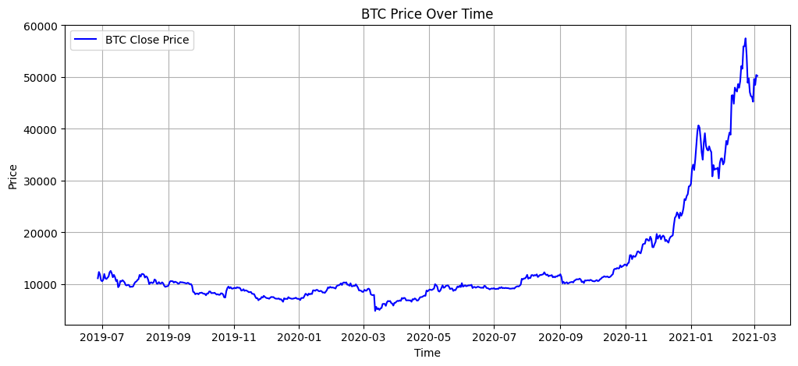
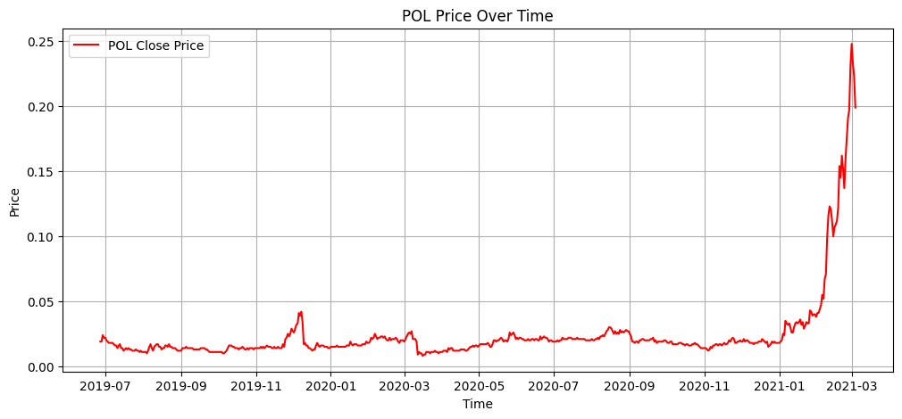
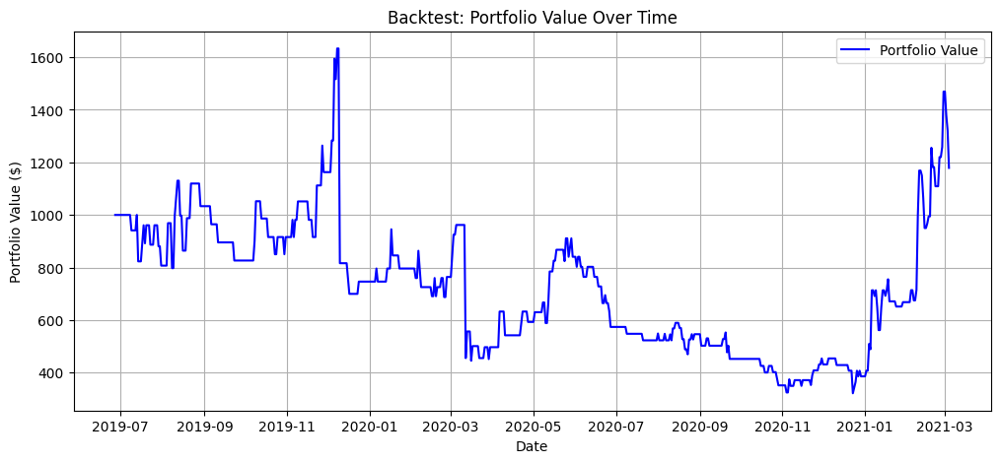

# Crypto Trading Strategy Based on Lagged Correlation

This project analyzes the correlation between Bitcoin (BTC) and Polygon (MATIC) prices and uses it to generate buy/sell signals for trading MATIC. It includes a complete backtest to evaluate how well the strategy would have performed over a historical period.

## Overview

* **Anchor Asset:** BTC (Bitcoin)
* **Target Asset:** MATIC (Polygon)
* **Strategy Type:** Lagged Correlation-Based Momentum
* **Timeframe:** June 27, 2019 to March 4, 2021

## Strategy Logic

1. **Data Collection:**

   * Historical daily price data for BTC and MATIC was collected.

2. **Lagged Correlation Analysis:**

   * For each lag (1 to 12 days), the correlation between BTC (shifted by that lag) and MATIC prices was computed.
   * The lag with the highest positive Pearson correlation was selected.

3. **Signal Generation:**

   * If BTC price at the optimal lag shows upward momentum (today's > yesterday's), generate a `BUY` signal.
   * If downward momentum, generate a `SELL` signal.
   * Else, `HOLD`.

4. **Backtesting:**

   * Start with a cash portfolio of \$1000.
   * Buy MATIC when signal is `BUY`, sell MATIC when signal is `SELL`.
   * Portfolio value is tracked and plotted over time.

## Final Performance

* **Initial Portfolio:** \$1000
* **Final Portfolio Value:** \~\$1178.87
* **Profit:** \~\$178.87

---

## Visualizations

### 1. BTC Price Over Time



### 2. MATIC Price Over Time



### 3. Backtest Portfolio Performance



---

## Files

* `BTC1D.csv` - Historical daily BTC data
* `Matic Historical Data.csv` - Historical MATIC data
* `strategy_backtest.ipynb` - Jupyter notebook with full code and analysis

## How to Run

1. Clone this repository:

```bash
https://github.com/your-username/crypto-lag-correlation-strategy.git
```

2. Open the notebook in Jupyter:

```bash
jupyter notebook strategy_backtest.ipynb
```

3. Run all cells to see outputs and plots.

---

## License

This project is licensed under the MIT License.

